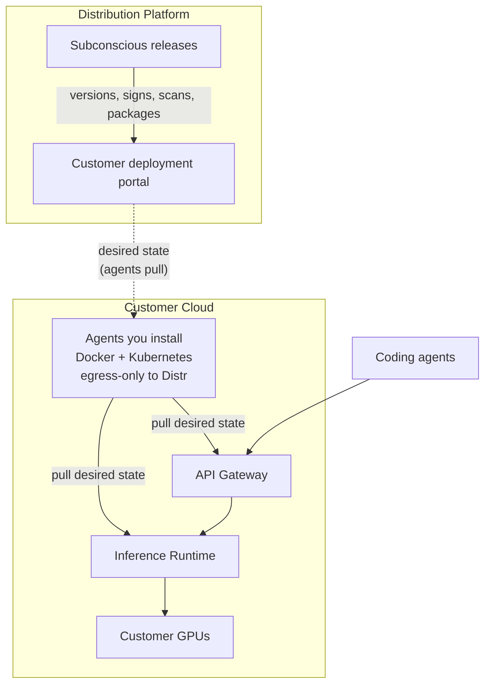
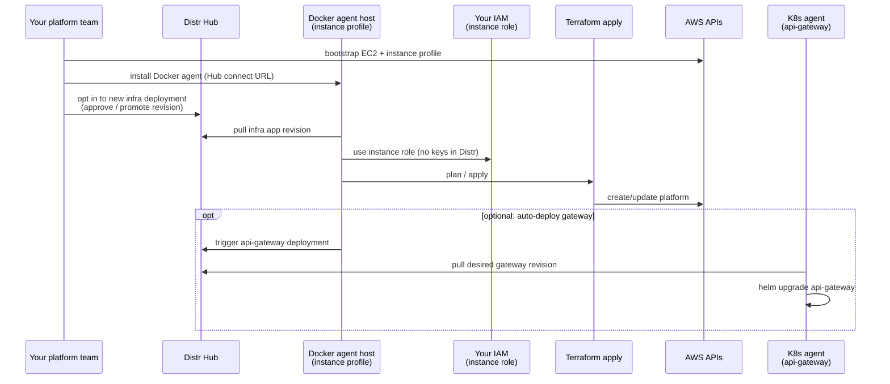
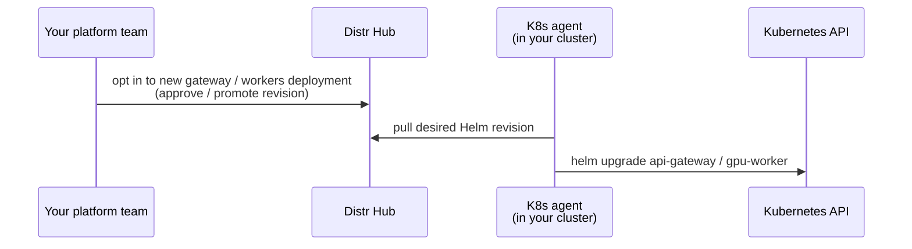
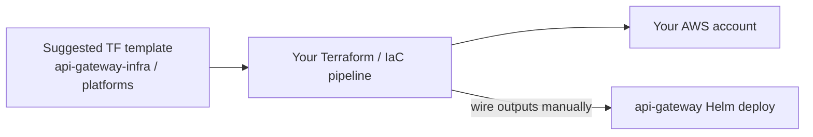
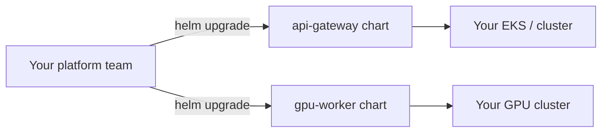

# Deployment trust model - security questions for your team

For security / platform stakeholders on how Subconscious lands inference in your cloud, and which Distr [distribution scenarios](https://distr.sh/docs/core-concepts/#distribution-scenarios) your constraints allow.

## System overview

Distr does **not** need inbound access into your VPC or agent hosts. Agents you install call **out** to Distr and to AWS/Kubernetes APIs.

## What is Distr?

[Distr](https://distr.sh/docs/core-concepts/#distribution-scenarios) is the distribution platform we use: artifact registry, customer portal, and agents that **pull** desired state into your environment. Two scenarios matter here:

- **Fully Self-Managed** (FSM) - you pull artifacts from the registry and deploy yourself.
- **Assisted Self-Managed** (ASM) - you keep control of environment access; Distr agents (that **you** install) handle install, updates, and maintenance.

We recommend the **Assisted Self-Managed** approach if your security constraints allow it, to minimize ongoing burden on your team. The two questions below decide how far that goes.

### Identity note (AWS platform automation)

AWS access stays **first-party** in your account: an EC2 **instance profile** you create, not access keys in Distr and not a Subconscious/vendor AssumeRole. Same class of trust as running Terraform from your own CI on a machine you operate.

---

## Decisions we need from you

| Question | Why it matters |
| --- | --- |
| **Q1** - May someone with Terraform rights in **your** account run our bootstrap (EC2 + instance profile), install a Distr Docker agent on that host, and let that agent **provision/update AWS platform resources** (VPC, EKS, RDS, IAM, DNS) via the instance role? | Create/destroy rights stay on **your** IAM role attached to a host **you** run. No AWS secrets in Distr; no external vendor profile. |
| **Q2** - May long-running **egress-only** Distr **Kubernetes** agents (like a Datadog Agent) install/upgrade Helm for `api-gateway` / `gpu-worker` as long as you opt-in to each new revision? | Agents change workloads in your cluster but do not need inbound management paths; they pull from Distr. |

### What that looks like

- **Yes to both** - Assisted Self-Managed end-to-end. Bootstrap EC2 + instance profile → Docker agent runs platform Terraform → K8s agent applies gateway/worker Helm after your opt-ins.
- **Yes to Q2 only** - You run platform Terraform yourselves; Distr K8s agents manage gateway/worker Helm only.
- **No to both** - Fully Self-Managed: artifacts from Distr registry; your team applies Terraform and Helm.

More details below.

---

## Assisted Self-Managed (recommended)

You install agents inside your boundary; they pull desired state from Distr (egress only). Two agents, in order:

### 1. Docker agent provisions AWS (Terraform)

**Day-0 bootstrap** ([`api-gateway/aws/bootstrap`](api-gateway/aws/bootstrap/)): someone with Terraform provisioning access in your account applies a small Terraform root (laptop or any Terraform-capable shell) that creates an EC2 host, security group (egress-only), and an **IAM instance profile** with platform-apply rights. No AWS access keys are written to Distr Hub, and there is no external vendor IAM profile - credentials never leave your account.

You then install the Distr **Docker** agent on that host (connect URL from Hub). The agent pulls the infra Compose app and runs Terraform **as the instance role**, creating VPC/EKS/RDS/IAM/DNS and the other resources the `api-gateway` application needs; once the K8s agent is connected, a follow-on infra run can auto-deploy the gateway Helm release.

### 2. Kubernetes agent deploys Helm

Long-running Distr **Kubernetes** agents (same pattern as a Datadog Agent) apply Helm for `api-gateway` and `gpu-worker` after you opt in to each revision. Egress only; cluster RBAC scopes what they can change.

---

## Fully Self-Managed

If agents are not allowed, you pull artifacts from the Distr registry and apply Terraform and Helm yourselves.

### You run Terraform

We provide a suggested Terraform template. You apply it and wire outputs to the `api-gateway` Helm deploy. No Distr-managed runtime holds provision rights.

### You run Helm

You install/upgrade the published charts on your schedule. Distr remains the artifact source. No long-running vendor agent for these products.

---

## Please reply with

1. **Q1** - Bootstrap EC2 + instance profile in your account; Docker agent on that host may provision AWS via the instance role: **yes** / **no**?
2. **Q2** - Egress-only K8s agents for gateway / worker Helm: **yes** / **no**?
