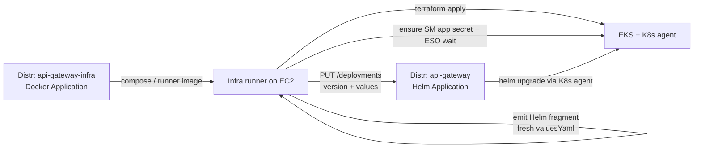
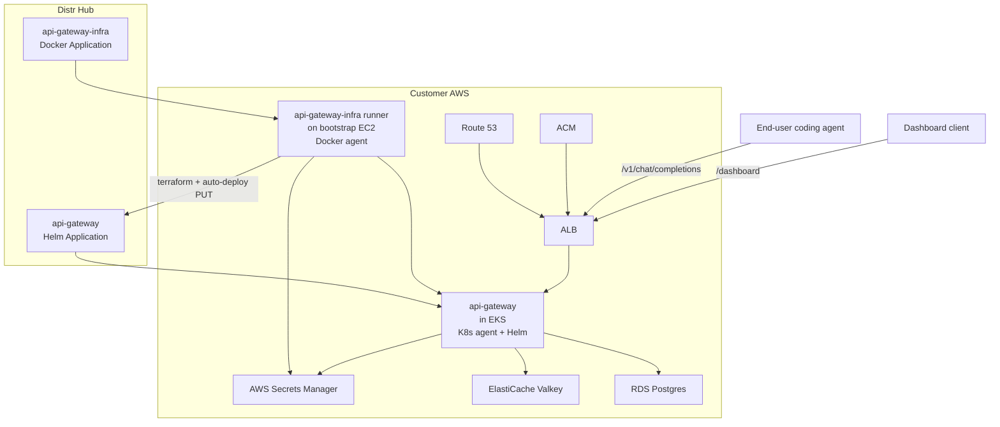

# API Gateway on AWS (Assisted Self-Managed)

Customer-facing architecture for deploying the Subconscious Inference System **API Gateway** on AWS with Distr.

For trust and security framing (Assisted vs Fully Self-Managed), see [TRUST_MODEL.md](../../TRUST_MODEL.md). Step-by-step setup: [instructions.md](instructions.md). Secrets: [gateway-secrets.md](gateway-secrets.md). Rotation: [secret-rotation.md](secret-rotation.md). Day-0 host bootstrap: [bootstrap/](bootstrap/).

## Architecture overview

Two Distr Applications cooperate. You install egress-only agents in your account; Distr does not need inbound access into your VPC.

| Application | Type | Where it runs | Job |
| --- | --- | --- | --- |
| **api-gateway-infra** | Distr **Docker** Application | Bootstrap EC2 (Distr Docker agent + runner) | Terraform for VPC/EKS/RDS/Valkey/ACM/addons; ensure AWS Secrets Manager app secret; wait for External Secrets Operator; emit Helm values; optional auto-deploy of the gateway app |
| **api-gateway** | Distr **Helm** Application | EKS via Distr **Kubernetes** agent | Installs/upgrades the gateway chart using runner-generated values |

AWS identity for platform Terraform is the bootstrap EC2 **instance profile**. Do not put AWS access keys in Distr Hub.

## How the two apps talk

The infra runner (Compose image on the Docker agent host) applies platform Terraform, then dynamically constructs Helm chart inputs for your setup and can trigger the gateway Distr deployment.

Ordered runner stages (simplified):

1. Ensure remote Terraform state (S3)
2. `terraform apply` for the AWS platform stack
3. Regenerate a gateway Helm values fragment from Terraform outputs + Hub env fields (always fresh YAML, not last-applied Hub values)
4. Ensure the AWS Secrets Manager `app` secret (generate-if-missing) and wait for ESO to sync `gateway-secrets`
5. If `GATEWAY_AUTO_DEPLOY=true`: resolve chart version (`GATEWAY_CHART_VERSION`) and `PUT` the api-gateway Distr deployment with that fragment

Implications:

- Hub hand-edits to gateway Helm overrides are **overwritten** on the next successful auto-deploy. Put lasting customizations on the infra env / fragment path, or set `GATEWAY_AUTO_DEPLOY=false` and manage values yourself.
- `GATEWAY_CHART_VERSION` selects the Distr application **version** only (`latest` / `nochange` / a version name like `0.15.0`). It does not change how values YAML is built.
- The first infra run often **soft-skips** auto-deploy until a Kubernetes deployment target named `GATEWAY_DISTR_DEPLOYMENT_NAME` exists. A second infra run (after the K8s agent is connected) is the normal path to install the gateway.

### Cluster secrets

Cluster secret source of truth is **AWS Secrets Manager** to **External Secrets Operator** to fixed Kubernetes Secrets (`gateway-secrets`, `router-secrets`, `worker-secrets`). Paths look like `orangeline/{DEPLOY_NAME}/rds|valkey|app`. Details: [gateway-secrets.md](gateway-secrets.md). Day-2 rotation: [secret-rotation.md](secret-rotation.md).

Distr Hub Secrets you create day-0 are only:

- `DISTR_TOKEN` (customer PAT)
- `DD_API_KEY` / `DD_APP_KEY` (infra / Datadog path when enabled)
- Optional dashboard bootstrap password (referenced from the infra env template)

Never put AWS access keys in Hub. Never put Datadog keys into gateway Helm wiring.

## System diagram

Ingress uses ACM (certificate) and Route 53 (DNS) in front of an internet-facing ALB that targets the gateway in EKS.

## Prerequisites

| Area | Requirement |
| --- | --- |
| Skills | Strong AWS; mild to strong Terraform, Kubernetes, and Helm |
| Hostname | Chosen subdomain / `DOMAIN_NAME` under an existing public Route 53 zone (`DNS_ZONE_NAME`); hostname must be free |
| GPUs (ideal) | Customer GPU hosts procured and ready for later worker configuration. The gateway can complete first; then see [gpu-deployment/README.md](../../gpu-deployment/README.md) |
| Datadog | Application key + API key ready for this deploy (sample path enables Datadog; both required when `DATADOG_ENABLED=true`) |
| Network | Non-overlapping `VPC_CIDR` (`/16` recommended) |
| Distr | Customer org access; ability to create a customer PAT |
| Bootstrap shell | Laptop with AWS CLI is easiest; any shell that can run Terraform against the account also works (for example an SSM session / bastion) |
| Bootstrap IAM | Enough to create EC2, EIP, security group, IAM role + instance profile + policy attach (often AdministratorAccess-equivalent on day-0) |
| Platform IAM | Instance profile from [bootstrap/policies/platform-apply.json](bootstrap/policies/platform-apply.json): broad `ec2` / `eks` / `elasticloadbalancing` / `autoscaling` / `rds` / `elasticache` / `iam` / `route53` / `acm` / `s3` / `secretsmanager` / `kms` / `logs` / `cloudwatch` / `ecr` / `sts` plus SSM GetParameter* (intentionally broad for day-0; narrowing is later hardening) |
| Tooling | AWS CLI, Terraform ≥ 1.6, [Session Manager plugin](https://docs.aws.amazon.com/systems-manager/latest/userguide/session-manager-working-with-install-plugin.html) for SSM break-glass scripts |
| Vendor (FDE) | Application + artifact entitlements **before** any agent pull; otherwise registry pulls fail with `entitlement required` |

Naming conventions: [FAQ.md](../../FAQ.md). Example infra env: [sample-gateway-infra.env](sample-gateway-infra.env).

## Next steps

1. [instructions.md](instructions.md): end-to-end FDE + admin checklist
2. [bootstrap/](bootstrap/): create the Docker agent EC2
3. [troubleshooting.md](troubleshooting.md): common hiccups and rollback notes
4. [gpu-deployment/README.md](../../gpu-deployment/README.md): after the gateway is healthy
