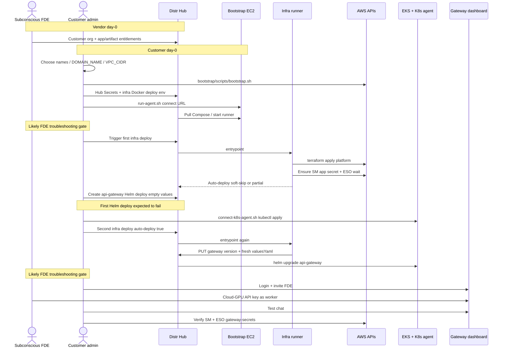

# AWS API Gateway setup instructions

End-to-end Assisted Self-Managed setup on AWS. Roles are labeled so one person can play both **FDE** (Subconscious Forward Deployed Engineer) and **Admin** (customer initial admin) during a demo.

Architecture: [README.md](README.md). Naming: [FAQ.md](../../FAQ.md). Secrets: [gateway-secrets.md](gateway-secrets.md). Rotation: [secret-rotation.md](secret-rotation.md). Bootstrap scripts: [bootstrap/](bootstrap/). Troubleshooting: [troubleshooting.md](troubleshooting.md).

Expect two FDE pairing / debug gates: (1) first Docker agent + infra runner bring-up, (2) second infra deploy / gateway auto-deploy. The first empty Helm deploy failure is anticipated.

## Sequence overview



## Checklist

### 1. FDE: Vendor portal entitlements

Work in the Distr **Vendor** portal for the customer org ([license management](https://distr.sh/docs/platform/license-management/)).

- [ ] Customer organization exists under **Licenses**
- [ ] **Application entitlements**: api-gateway-infra (Docker) + api-gateway (Helm). Prefer all tags + future for day-0
- [ ] **Artifact entitlements**: `subconscious/api-gateway-infra/runner`, `subconscious/charts/api-gateway`, `subconscious/api-gateway/*`, and tool images the chart pulls
- [ ] Published tags exist in `registry.distr.sh` for the versions the customer will pull
- [ ] Customer can sign in to the Customer Portal and create a PAT

Deployment **targets** are not entitlements. The admin creates those when connecting agents. Skipping entitlements causes `entitlement required` on pull.

### 2. Admin: Naming and account prep

- [ ] Choose names per [FAQ.md](../../FAQ.md) (≤ 32 characters each):
  - `DEPLOY_NAME`: infra Docker deploy + TF name prefix (example: `acme-api-gateway-infra`)
  - `GATEWAY_DISTR_DEPLOYMENT_NAME`: gateway Helm deploy = Kubernetes namespace = Helm release (example: `acme-api-gateway`)
  - `DOMAIN_NAME`: public hostname (subdomain under your zone)
  - `VPC_CIDR`: non-overlapping `/16`
- [ ] Public Route 53 zone exists (`DNS_ZONE_NAME`); `DOMAIN_NAME` is free
- [ ] Datadog API key + application key ready
- [ ] Ability to create a Distr customer PAT

### 3. Admin: Clone the runbook

```bash
git clone git@github.com:subconscious-systems/ol-runbook.git
cd ol-runbook
```

### 4. Admin: Bootstrap the Docker agent EC2

From a laptop (or any Terraform-capable shell) with AWS credentials for the target account:

```bash
cd api-gateway/aws/bootstrap
cp terraform.tfvars.example terraform.tfvars   # edit region / name_prefix if needed
# optional remote state:
#   cp backend.tf.example backend.tf && edit bucket/key
./scripts/bootstrap.sh
```

This creates the EC2 host, EIP, security group, and IAM instance profile used by the infra runner. Details: [bootstrap/README.md](bootstrap/README.md).

### 5. Admin: Distr Hub Secrets

In the customer Distr org, create Hub Secrets (masked values):

| Hub secret key | Notes |
| --- | --- |
| `DISTR_TOKEN` | Customer PAT (not a vendor publish token) |
| `DD_API_KEY` | Required when Datadog is enabled |
| `DD_APP_KEY` | Required when Datadog is enabled |
| `{gw}_GATEWAY_DASHBOARD_BOOTSTRAP_PASSWORD` | Optional; 12+ chars. `{gw}` = `GATEWAY_DISTR_DEPLOYMENT_NAME` |

Do **not** create AWS access-key Hub Secrets. Cluster DB/Redis/crypto material is not hand-created as Hub `{gw}_GATEWAY_*` keys. See [gateway-secrets.md](gateway-secrets.md).

### 6. Admin: Infra Docker deployment

- [ ] Create the **api-gateway-infra** Docker deployment in Hub
- [ ] Paste env from [sample-gateway-infra.env](sample-gateway-infra.env), adapting names/region/domain/CIDR to your settings
- [ ] Keep `{{.Secrets.…}}` refs for secrets; do not paste plaintext PAT/DD keys into env
- [ ] Save the Docker-agent **connect URL** from Hub for the next step

### 7. Admin: Connect the Distr Docker agent

Create the Docker deployment target if Hub prompts for one, then:

```bash
cd api-gateway/aws/bootstrap
./scripts/run-agent.sh 'https://app.distr.sh/api/v1/connect?targetId=…&targetSecret=…'
```

This installs the Distr Docker agent on the bootstrapped EC2. The agent pulls Compose from Hub and starts the infra runner.

**Likely FDE troubleshooting gate.** Entitlements, image pull, and first compose failures are common here. Do not proceed until the agent/runner is healthy. See [troubleshooting.md](troubleshooting.md).

Trigger the **first** infra deploy from Hub once the agent is connected (platform Terraform + SM/ESO). Auto-deploy of the gateway may soft-skip until the K8s target exists; that is expected.

### 8. Admin: Create the api-gateway Helm deployment (expected fail)

- [ ] Create the **api-gateway** Helm deployment object
- [ ] Deployment / target name = `GATEWAY_DISTR_DEPLOYMENT_NAME`
- [ ] Leave Helm values empty
- [ ] Deploy and copy the Hub `kubectl apply -n … -f "https://…"` connect command

**NOTE:** this first deploy is **expected to fail**. The Kubernetes agent is not connected yet and platform secrets/values are not fully wired.

### 9. Admin: Connect the Distr Kubernetes agent

```bash
cd api-gateway/aws/bootstrap
./scripts/connect-k8s-agent.sh \
  'kubectl apply -n <GATEWAY_DISTR_DEPLOYMENT_NAME> -f "https://app.distr.sh/api/v1/connect?…"'
```

This runs `kubectl` over SSM on the bootstrap host and installs `distr-agent` pods **in EKS** (not on the EC2). Day-0 EKS API access is CIDR-locked to the bootstrap host EIP.

### 10. Admin: Second infra deploy (gateway auto-deploy)

- [ ] Ensure `GATEWAY_AUTO_DEPLOY=true` and `GATEWAY_CHART_VERSION=latest` (or a pin / `nochange` as appropriate)
- [ ] Trigger a **second** api-gateway-infra deploy in Hub

The runner regenerates the Helm fragment, ensures SM/ESO secrets, and `PUT`s the gateway deployment with correct values.

**Likely FDE troubleshooting gate.** When healthy, the dashboard should be reachable at `https://<DOMAIN_NAME>/dashboard`.

### 11. Admin: Dashboard login and invite

- [ ] Open the URL from the api-gateway deploy / `DOMAIN_NAME`
- [ ] Log in with the bootstrap admin password (identity-bootstrap Job when the Hub secret was provided)
- [ ] Invite the FDE via invite link

If identity bootstrap was skipped, use break-glass `ops-cli identity bootstrap` (see troubleshooting).

### 12. FDE: Cloud-hosted GPU worker key

- [ ] Obtain an API key from Subconscious cloud-hosted GPUs
- [ ] Configure it in the customer gateway as a worker/provider so the stack can exercise inference before customer GPUs are wired

### 13. Admin: Test chat

- [ ] Run a test chat in the dashboard
- [ ] Success means the dual-app path is good for gateway + a temporary cloud worker

### 14. Admin: Final secrets verification

- [ ] Confirm AWS Secrets Manager paths exist: `orangeline/{DEPLOY_NAME}/rds`, `…/valkey`, `…/app`
- [ ] Confirm ESO synced Kubernetes Secrets (`gateway-secrets`, and related) in namespace `GATEWAY_DISTR_DEPLOYMENT_NAME`

See [gateway-secrets.md](gateway-secrets.md).

## After this

Configure GPU workers on the customer’s AWS GPUs:

→ [gpu-deployment/README.md](../../gpu-deployment/README.md)

Gateway deploy is complete; workers are a separate runbook path.
