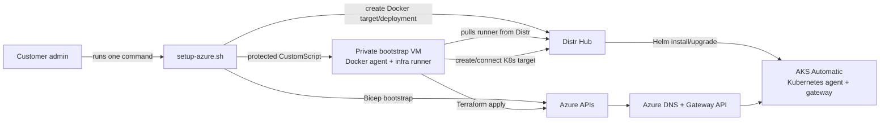

# API Gateway on Azure

Customer-facing architecture and setup notes for deploying the Subconscious Inference System **API Gateway** on Azure with Distr.

The Azure path is intentionally simpler than the AWS and GCP paths:

- One customer command starts the whole deployment.
- The normal path asks for four values: deployment slug, gateway hostname, provider DNS suffixes, and a Distr PAT.
- Distr creates and connects both agents: Docker first, then Kubernetes from inside the infra runner.
- The first infra run also deploys the gateway chart; there is no manual Kubernetes target handoff.
- The bootstrap VM has no public IP and no inbound SSH rule.

Step-by-step setup: [instructions.md](instructions.md). Bootstrap implementation: [bootstrap/](bootstrap/). Example infra environment: [sample-gateway-infra.env](sample-gateway-infra.env). SSO after install: [Entra](../sso-entra.md) or [Okta](../sso-okta.md).

## Architecture overview

Two Distr Applications cooperate:

| Application | Type | Where it runs | Job |
| --- | --- | --- | --- |
| **api-gateway-infra-azure** | Distr **Docker** Application | Private Azure bootstrap VM | Creates AKS Automatic, private data services, Key Vault, Gateway API routing, External Secrets, cert-manager, and the Distr Kubernetes target |
| **api-gateway** | Distr **Helm** Application | AKS through the Distr Kubernetes agent | Installs/upgrades the gateway chart using runner-generated values |

Azure identity for platform Terraform is the bootstrap VM user-assigned managed identity. Do not put Azure client secrets or access keys in Distr Hub.

## Control flow



Ordered runner stages:

1. Ensure remote Terraform state in the customer storage account.
2. Apply the Azure platform stack.
3. Configure private AKS access from the runner.
4. Create or reconnect the Distr Kubernetes deployment target automatically.
5. Ensure the Key Vault app secret and External Secrets sync.
6. Generate the gateway Helm values fragment.
7. Deploy the gateway Helm application through Distr.
8. Verify the public health and readiness endpoints.

The runner always regenerates Helm values from Terraform outputs and the infra environment. Durable customization belongs in the infra environment fields, not in hand-edited gateway Helm values.

## Azure resources

The bootstrap creates the smallest durable foundation needed to let Distr run the rest:

| Area | Resource |
| --- | --- |
| Bootstrap | Resource group, private VM, managed identity, VNet/subnet, storage account/container for Terraform state |
| Network | Dedicated VNet, private AKS API access, private endpoints / private DNS for data services |
| Compute | AKS Automatic with application routing Gateway API support |
| Data | Azure Database for PostgreSQL Flexible Server and Azure Managed Redis |
| Secrets | Azure Key Vault plus External Secrets Operator |
| Routing | Azure DNS, cert-manager AzureDNS issuer, Gateway API `Gateway` and `HTTPRoute` resources |

## Prerequisites

| Area | Requirement |
| --- | --- |
| Azure access | Active Azure CLI session with permissions to create the bootstrap resource group and assign roles. Owner is easiest for day-0; Contributor plus User Access Administrator can also work. |
| DNS | Existing Azure public DNS zone that contains the requested gateway hostname. |
| Tools | Azure CLI, `jq`, `curl`, `openssl`, `python3`, and `ssh-keygen` on the laptop running setup. |
| Distr | Customer org access, app/artifact entitlements, and a customer PAT. |
| Vendor package | Azure infra Distr application id provided as `API_GATEWAY_INFRA_AZURE_APPLICATION_ID` or `--infra-application-id`. |

## Next steps

Start with [instructions.md](instructions.md). The normal setup is:

```bash
cd api-gateway/azure/bootstrap
API_GATEWAY_INFRA_AZURE_APPLICATION_ID=<vendor-provided-id> ./scripts/setup-azure.sh
```

When the command finishes, open `https://<gateway-hostname>/dashboard`.
