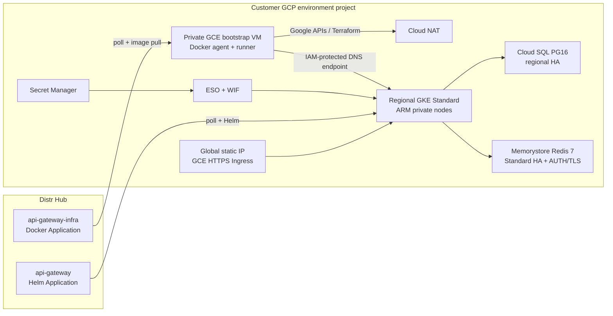

# API Gateway on GCP (Assisted Self-Managed)

Customer-facing architecture for deploying the Subconscious Inference System
API Gateway on Google Cloud with Distr. The setup intentionally mirrors the
[AWS workflow](../aws/instructions.md): one Docker-agent bootstrap host, one
infra Docker Application, one gateway Helm Application, and two infra
deployment cycles around connecting the Kubernetes agent.

Step-by-step setup: [instructions.md](instructions.md). Bootstrap:
[bootstrap/](bootstrap/). Secrets: [gateway-secrets.md](gateway-secrets.md).
Rotation: [secret-rotation.md](secret-rotation.md). Operations:
[datadog-operations.md](datadog-operations.md),
[gke-upgrade.md](gke-upgrade.md),
[rollback.md](rollback.md), and
[teardown.md](teardown.md).

For environments where Ryvn runs Terraform and the Kubernetes installation,
use the separate [Ryvn-managed environment setup](ryvn-environment-setup.md).

## Architecture overview

| Application | Type | Where it runs | Job |
| --- | --- | --- | --- |
| `api-gateway-infra` | Distr Docker Application | Private bootstrap VM | Terraform for VPC, GKE, Cloud SQL, Redis, DNS, ESO/WIF, Datadog, and generated Helm values |
| `api-gateway` | Distr Helm Application | GKE via the Kubernetes agent | Installs and upgrades the gateway chart |

The bootstrap VM authenticates with its attached service account. Distr never
receives Google credentials. Both agents make egress-only connections to Hub.

The normal deployment sequence is the same as AWS:

1. Bootstrap the Docker-agent VM.
2. Create Hub secrets and the infra Docker deployment.
3. Connect the Docker agent and run infra with `GATEWAY_AUTO_DEPLOY=false`.
4. Create the gateway Helm deployment and connect the Kubernetes agent.
5. Re-run infra with `GATEWAY_AUTO_DEPLOY=true`.

GCP internally creates its cloud foundation before the in-cluster resources so
the Terraform runner can reach the IAM-protected GKE DNS endpoint. That
checkpoint completes inside the first infra deployment and does not add a
customer-facing deployment cycle.

## Production architecture

| Layer | Required configuration |
| --- | --- |
| Project | One existing production project; its DNS zone may be local or in a shared DNS project |
| Region | `us-east1` |
| Kubernetes | GKE Standard regional cluster; N4A node pool in `us-east1-b`/`us-east1-c`; two `n4a-standard-4` ARM64 nodes initially, autoscaling 2–4 |
| Control plane | Private nodes; DNS-based endpoint enabled; IP endpoints disabled; IAM permission `container.clusters.connect` required |
| Network | Custom VPC, private Google access, separate Pod/Service ranges, Cloud NAT |
| PostgreSQL | Cloud SQL PostgreSQL 16, Enterprise, regional HA, private IP only, automated backups and PITR |
| Cache | Memorystore for Redis 7, `STANDARD_HA`, private service access, AUTH enabled, server-authenticated TLS |
| Ingress | GCE Ingress, reserved global static IP, `ManagedCertificate`, `FrontendConfig` HTTP→HTTPS redirect, public `BackendConfig` (`timeoutSec: 900`, HTTP `/readyz` on 31080, 270s connection draining) |
| Secrets | Secret Manager → External Secrets Operator (ESO) using Workload Identity Federation for GKE |
| Bootstrap | Private `e2-standard-2` GCE VM, attached service account, Cloud NAT, IAP + OS Login; no service-account key or public IP |
| Observability | Datadog GCP STS integration, GKE Agent, managed gateway assets, and direct Cloud SQL PostgreSQL DBM |

Before installation, verify N4A quota and capacity in `us-east1-b` and
`us-east1-c`. The gateway can become healthy without GPU capacity; inference
requires an approved provider or worker endpoint.

## GCP-only differences from AWS

- The bootstrap Terraform deploys into a selected existing project and never
  creates, imports, moves, relabels, or deletes that project.
- Human login needs both gcloud user auth and Application Default Credentials.
- The first local state is automatically migrated into the new GCS bucket.
- The platform service account receives scoped DNS access in the existing DNS
  project.
- Operator access uses IAP/OS Login and the GKE DNS endpoint instead of SSM and
  the EKS endpoint.

Hub secrets, deployment naming, Docker/Kubernetes agent connection, gateway
version selection, generated Helm values, and the second infra auto-deploy
match AWS.

## Request and control paths

Clients resolve `DOMAIN_NAME` in Cloud DNS and reach the reserved global IP.
HTTP redirects to HTTPS. The GCE Ingress uses a Google-managed certificate and
a 900-second backend timeout so long streaming/inference requests are not cut
off at the default backend timeout.

Gateway pods reach Cloud SQL and Redis over private addresses only. Redis uses
port 6378/TLS with AUTH. Cloud SQL requires encrypted PostgreSQL connections.
The generated URLs live in Secret Manager, not in Terraform tfvars, this
repository, or Distr Helm values.

Operators reach the bootstrap VM through IAP/OS Login. The VM and automation
reach the GKE API through its DNS endpoint. IP-based control-plane endpoints
remain disabled; authorization is identity-based through IAM and Kubernetes
RBAC.

## Production naming

Keep each Distr deployment name at most 32 characters:

- infra `DEPLOY_NAME` = GKE cluster name and secret-bundle name component;
- gateway `GATEWAY_DISTR_DEPLOYMENT_NAME` = Kubernetes namespace = Helm release;
- optional `GATEWAY_DISTR_PORTAL_NAME` when the Hub Kubernetes target was renamed;
- the state bucket and prefix belong only to the production project;
- `DATADOG_ENV` uniquely identifies the production deployment;
- public hostname and global static IP name are unique.

## Prerequisites

- Rights in an existing billing-enabled production project to enable services,
  set IAM, and update the selected Cloud DNS zone.
- One existing production project ID, an existing DNS project/zone (which may
  be the same project), and non-overlapping
  RFC1918 `/24` bootstrap and `/16` platform ranges.
- Distr customer PAT plus Application and artifact entitlements.
- Terraform 1.11.4+, gcloud, GKE auth plugin, jq, and curl.
- Optional Datadog API/application keys and GCP STS approval.

## Next steps

1. [instructions.md](instructions.md) — one-command guided installer and detailed checklist
2. [bootstrap/](bootstrap/) — project and private Docker-agent VM
3. [sample-gateway-infra.env](sample-gateway-infra.env) — Hub environment
4. [gateway-secrets.md](gateway-secrets.md) — Secret Manager, ESO, and WIF
5. [secret-rotation.md](secret-rotation.md) — crypto, database, Redis, and API keys
6. [datadog-operations.md](datadog-operations.md) — STS, Agent, DBM, dashboards
7. [gke-upgrade.md](gke-upgrade.md) — one-minor staged operation
8. [troubleshooting.md](troubleshooting.md) — common GCP failure modes
9. [rollback.md](rollback.md) — release rollback
10. [teardown.md](teardown.md) — ordered platform teardown
11. [cost-estimate.md](cost-estimate.md) — planning estimate and live-pricing gate
12. [ryvn-environment-setup.md](ryvn-environment-setup.md) — Ryvn-managed project identity and provisioning setup
