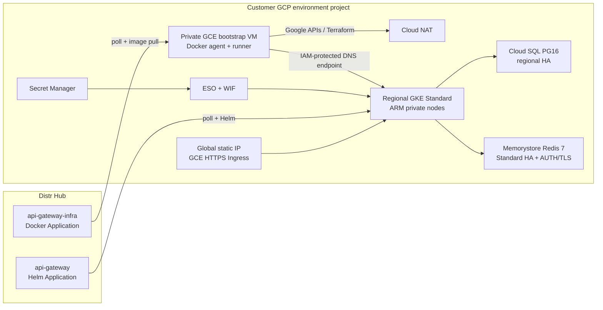

# API Gateway on GCP (greenfield production parity)

Customer-facing runbook for an Assisted Self-Managed Subconscious Inference
System API Gateway on Google Cloud. This path is greenfield: it creates
independent sandbox and production projects and does not migrate AWS data or
provision GPU workers.

> **Release gate:** this runbook defines the required GCP production contract,
> but the selected `api-gateway-infra` Distr Application must explicitly state
> that its complete `CLOUD=gcp` path is enabled. A runner that still identifies
> GCP as a stub will fail closed and cannot create this stack. Complete the full
> sandbox dress rehearsal before production.

End-to-end checklist: [instructions.md](instructions.md). Project/VM bootstrap:
[bootstrap/](bootstrap/). Secrets: [gateway-secrets.md](gateway-secrets.md).
Rotation: [secret-rotation.md](secret-rotation.md). Operations:
[datadog-operations.md](datadog-operations.md),
[gke-upgrade.md](gke-upgrade.md),
[rollback.md](rollback.md), and
[teardown.md](teardown.md).

## Locked architecture

Sandbox and production use the same topology, sizing, and controls, but no
project, cluster, state prefix, service account, secret, or Distr deployment is
shared.

| Layer | Required configuration |
| --- | --- |
| Projects | Separate sandbox and production projects with billing and quotas |
| Region | `us-east1` |
| Kubernetes | GKE Standard regional cluster; N4A node pool in `us-east1-b`/`us-east1-c`; two `n4a-standard-4` ARM64 nodes initially, autoscaling 2–4 |
| Control plane | Private nodes; DNS-based endpoint enabled; IP endpoints disabled; IAM permission `container.clusters.connect` required |
| Network | Custom VPC, private Google access, separate Pod/Service ranges, Cloud NAT |
| PostgreSQL | Cloud SQL PostgreSQL 16, Enterprise, regional HA, private IP only, automated backups and PITR |
| Cache | Memorystore for Redis 7, `STANDARD_HA`, private service access, AUTH enabled, server-authenticated TLS |
| Ingress | GCE Ingress, reserved global static IP, `ManagedCertificate`, `FrontendConfig` HTTP→HTTPS redirect, public `BackendConfig` (`timeoutSec: 900`, HTTP `/readyz` on 31080, 270s connection draining) |
| Secrets | Secret Manager → External Secrets Operator (ESO) using Workload Identity Federation for GKE |
| Bootstrap | Private `e2-standard-2` GCE VM, attached service account, Cloud NAT, IAP + OS Login; no service-account key or public IP |
| Observability | Datadog GCP STS integration, GKE Agent, managed gateway assets, and direct Cloud SQL PostgreSQL DBM |

`n4a-standard-4` is Google Axion ARM64. Before every new environment, verify
live N4A quota and capacity in at least two `us-east1` zones; a documented
machine type is not a capacity reservation.

## Two Distr Applications

| Application | Type | Where it runs | Responsibility |
| --- | --- | --- | --- |
| `api-gateway-infra` | Docker | Private bootstrap GCE VM | GCS state; VPC/GKE/Cloud SQL/Redis/DNS/ingress dependencies; WIF/ESO; Datadog; generated Helm fragment; optional gateway deployment update |
| `api-gateway` | Helm | GKE via the Distr Kubernetes agent | Gateway, router, adapter, migrations, dashboard, services, and GCE Ingress resources |

The bootstrap VM authenticates to Google APIs with its attached service
account. Distr Hub never receives a GCP credential file. Both agents make
egress-only connections to Distr.



## Request and control paths

Clients resolve `DOMAIN_NAME` in Cloud DNS and reach the reserved global IP.
HTTP redirects to HTTPS. The GCE Ingress uses a Google-managed certificate and
a 900-second backend timeout so long streaming/inference requests are not cut
off at the default backend timeout.

Gateway pods reach Cloud SQL and Redis over private addresses only. Redis uses
port 6378/TLS with AUTH. Cloud SQL requires encrypted PostgreSQL connections.
The generated URLs live in Secret Manager, not in Terraform tfvars, this
repository, or Distr Helm values.

Operators reach the bootstrap VM through IAP/OS Login. The VM and automation
reach the GKE API through its DNS endpoint. IP-based control-plane endpoints
remain disabled; authorization is identity-based through IAM and Kubernetes
RBAC.

## Project and environment model

Use readable, distinct identifiers:

```text
acme-gateway-sbox   # sandbox GCP project
acme-gateway-prod   # production GCP project

acme-sbox-api-gateway-infra / acme-sbox-api-gateway
acme-prod-api-gateway-infra / acme-prod-api-gateway
```

Keep each Distr deployment name at most 32 characters. In each environment:

- infra `DEPLOY_NAME` = GKE cluster name and secret-bundle name component;
- gateway deployment name = Kubernetes namespace = Helm release;
- state bucket and state prefix are environment-specific;
- `DATADOG_ENV` is environment-specific;
- public hostname and global static IP name are unique.

Do not promote by copying Terraform state, Secret Manager versions, Cloud SQL
backups, or Redis data between projects. Promote the same pinned Application
versions and reviewed configuration, then run independent smoke checks.

## Prerequisites

- Google Cloud organization/folder, billable account, and project-creation
  approval.
- Cloud DNS ownership for separate sandbox and production hostnames.
- Quota/capacity confirmation for regional GKE, N4A vCPU, Cloud SQL regional
  HA, Memorystore, global IP/forwarding rules, NAT, and SSD/backup storage.
- Distr customer organization, PAT, artifact entitlements, and access to the
  separate GCP infra Application published from `runner/template.gcp.env`.
- A GCP infra Application version that uses the same runner image/version as
  the reviewed release and implements this exact contract.
- Datadog API/application keys and permission to configure the GCP STS
  integration.
- One canonical, non-overlapping RFC1918 `/16` per environment; platform
  Terraform deterministically carves node, Pod, Service, private-service, and
  control-plane ranges from it.
- Terraform 1.11.4+, gcloud, GKE auth plugin, kubectl, jq, and curl.

No GPU capacity is required to make the gateway/dashboard healthy. An
authenticated inference smoke requires an already approved provider endpoint;
GPU host provisioning remains outside this runbook.

## Required release contract

Before using a runner release, confirm its release notes and a dry-run show all
of the following:

- `CLOUD=gcp`, `GCP_PROJECT`, `GCP_REGION`, GCS backend, and DNS-endpoint
  kubeconfig support;
- regional GKE Standard with `n4a-standard-4` ARM nodes, WIF enabled, private
  nodes, DNS endpoint external traffic enabled, and IP endpoints disabled;
- Cloud SQL PG16 regional HA/private IP/backups/PITR and Redis 7
  Standard HA/AUTH/TLS;
- the three Secret Manager bundles and ESO projections;
- GCE Ingress static IP, ManagedCertificate, FrontendConfig, and BackendConfig
  900-second overlay;
- Datadog STS, Agent, and PostgreSQL DBM support;
- GCP app-secret ensure and rotation support;
- portable outputs and a generated GCP Helm values fragment;
- a sandbox create/reapply/destroy test from the same release.

If any item is absent, stop. Do not compensate with hand-edited Helm values,
plaintext secrets, public VM addresses, service-account keys, or ad hoc cloud
resources.

## Runbook map

1. [instructions.md](instructions.md) — greenfield sandbox then production
2. [bootstrap/](bootstrap/) — projects, APIs, private keyless VMs, state migration
3. [sample-gateway-infra.env](sample-gateway-infra.env) — Distr infra environment
4. [gateway-secrets.md](gateway-secrets.md) — Secret Manager, ESO, and WIF
5. [secret-rotation.md](secret-rotation.md) — crypto, database, Redis, and API keys
6. [datadog-operations.md](datadog-operations.md) — STS, Agent, DBM, dashboards
7. [gke-upgrade.md](gke-upgrade.md) — one-minor staged operation
8. [troubleshooting.md](troubleshooting.md) — common GCP failure modes
9. [rollback.md](rollback.md) — release rollback
10. [teardown.md](teardown.md) — ordered platform teardown
11. [cost-estimate.md](cost-estimate.md) — planning estimate and live-pricing gate
