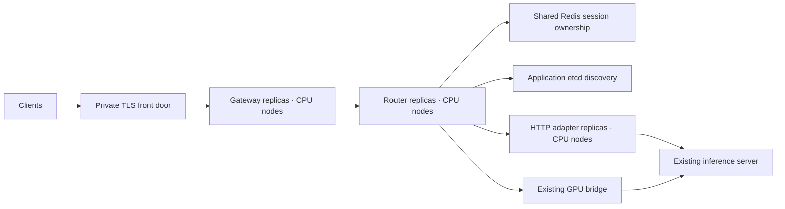

# Production Kubernetes control plane

Run the gateway, router, and HTTP adapter on dedicated CPU nodes. Existing GPU
servers remain separately managed endpoints. This gateway release contains no
GPU workload, GPU operator, DaemonSet, bridge installer, or model rollout.



## Placement and availability

Layer the gateway chart's `values-production-linux.yaml`, then
`values-production-kubernetes.yaml`, then installation-specific inputs.
Use the reviewed gateway chart and matching digest-pinned images supplied for
the installation. All three application Deployments start with two replicas.
The Kubernetes overlay uses a ClusterIP gateway Service and requires nodes
labeled `subconscious.ai/node-role=control-plane`; apply this label only to the
dedicated CPU pool. Migration and service-identity hook Jobs use the same pool.
No CPU workload in this release requests GPU resources.

Required pod anti-affinity keeps replicas of each component on different nodes.
Provide **at least three eligible CPU nodes** for two replicas plus one rolling
surge. Zone spreading is preferred where zone labels exist. A single-host
installation can use the Linux profile instead, but is not host-failure tolerant.
The optional router HPA requires metrics-server and enough CPU nodes for its
maximum replicas plus one surge. It never scales GPU workers.

Use external, backup-tested Postgres and Redis, plus a separately operated
application etcd service. Never point discovery at Kubernetes control-plane
etcd. Their availability and backup/restore procedures are part of the deployment,
not provided by this chart. Keep application discovery accessible only over the
private network; configure etcd TLS/auth using the installation's approved
secret and runtime configuration.

## Private connectivity

Installation inputs must include the HTTPS dashboard URL, TLS front door,
image digests, secret references, allowed upstream hosts, and restricted peers
for Postgres, Redis, and provider traffic. Add native connectivity explicitly:

```yaml
router:
  dynamo:
    endpoint: installation.workers.generate
    etcdEndpoints: http://application-etcd.discovery.svc.cluster.local:2379

networkPolicy:
  dynamo:
    enabled: true
    discoveryPeers:
      - namespaceSelector:
          matchLabels:
            kubernetes.io/metadata.name: discovery
        podSelector:
          matchLabels:
            app.kubernetes.io/name: application-etcd
    discoveryPort: 2379
    workerPeers:
      # Documentation address only: replace with the existing private GPU host.
      - ipBlock:
          cidr: 192.0.2.20/32
    workerRpcPort: 31002
```

The router needs outbound TCP to application etcd and existing bridge RPC.
Bridges need TCP connectivity back to each router pod's response port, `31003`.
Both directions require routable addresses; an HTTP tunnel to the engine alone
does not provide native RPC connectivity. Existing GPU-host firewalls and the
cluster network must already permit these paths. The chart only changes policies
on router pods. HTTP-only installations can leave `workerPeers` empty and use
existing endpoint URLs and credentials. They still require application discovery
for the router runtime. Preserve the configured discovery endpoint and worker
pool names when attaching existing bridges.

## Operations in the gateway

Under **Model groups**, each group's routing status combines desired endpoint
configuration, registration state, and observed workers:

| Condition | Meaning / action |
| --- | --- |
| Ready | The endpoint has a worker reporting fresh readiness. Check admission load before adding traffic. |
| Degraded | Some workers are unavailable or the endpoint is marked degraded. Inspect worker health and load before increasing traffic. |
| Pending sync | The desired endpoint is not yet active in the responding router. Inspect endpoint registration. |
| Sync failed | Open the endpoint's error details, correct configuration, then retry sync. |
| Draining | Router membership excludes new requests; admitted streams may finish. |
| No ready workers | Check existing bridge connectivity and heartbeat/engine health. |
| Registered | HTTP route registered; GPU readiness is not reported. |
| Disabled / Excluded | The group, endpoint, or endpoint health excludes new requests. |

The router strip describes **one responding router**, not the entire Kubernetes
Deployment. Its request count includes all models. Refreshes may hit different
replicas. Use Kubernetes readiness and the platform metrics dashboard to assess
all replicas. Missing GPU or cache samples stay unavailable; they are never
presented as zero utilization or guaranteed cache residency. No extra worker
collector is required to use the control-plane dashboard.

Disabling an endpoint takes effect through reconciliation; existing admitted
streams may continue. Deleting a model group permanently removes its endpoint
records and worker-key links. Provider credentials and historical usage are
separate records. These actions change routing, not the running GPU engine.

## Rollouts and recovery

Each Deployment uses zero-unavailable rolling updates, a readiness soak period,
a rollout deadline, and retained revisions. Disruption budgets limit voluntary
evictions. During termination, the router allows 30 seconds for endpoint removal
to propagate, then SIGTERM closes new admission while existing streams drain.
The default 300-second pod grace includes this delay: streams longer than the
remaining budget can be interrupted. Match grace periods to measured request
durations and front-door timeouts before production traffic.

See Kubernetes' [termination sequence](https://kubernetes.io/docs/concepts/workloads/pods/pod-lifecycle/#pod-termination)
and [Deployment rollout behavior](https://kubernetes.io/docs/concepts/workloads/controllers/deployment/).
Disruption budgets do not prevent node failures or protect against every forced
deletion. Router replicas share session ownership in Redis; they reconstruct
worker observations independently and may briefly disagree during recovery.

Monitor accepting-router count, ready workers **per router**, active requests,
unavailable responses, session placement, and cache placement. Do not sum worker
observations across routers: they observe the same GPU workers. An absent metric
series means unavailable telemetry, not a healthy zero.

Before any install, render/lint the exact chart and inputs offline and review the
manifest. The release should contain only CPU application workloads and hook
Jobs. A staged CPU fixture run should cover rolling updates, a lost router,
Redis/discovery interruption, in-flight stream completion/cancellation, and
registration recovery. Actual GPU rollout, load tests, bridge updates, and new
collectors are separate operations requiring an explicitly authorized window.
This configuration and offline validation alone are not evidence of completed
production failure drills.
